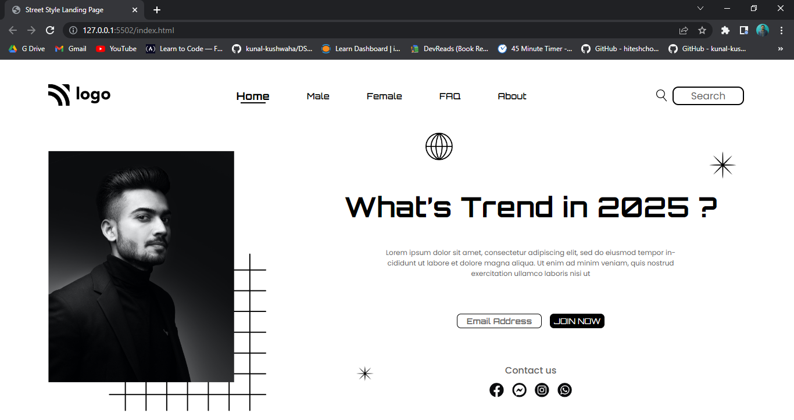

# Street Style Landing Page

Hi 👋 I am Shobhan Sundar Goutam. This project is made with the help of `HTML` and `CSS`.

 

### Screenshot

- ### Learnings from this project:-

  - Learned to use Relative and Absolute properties of CSS Positions.
  - Learned to use the Direct Child Selector.
  - Learned to use pseudo classes like `:root`, `:first-child` and `:nth-child()`.
  - Learned to use pseudo element `::after` and learned how to give a styled border bottom.

- It took around _8-9 hours_ to complete.
